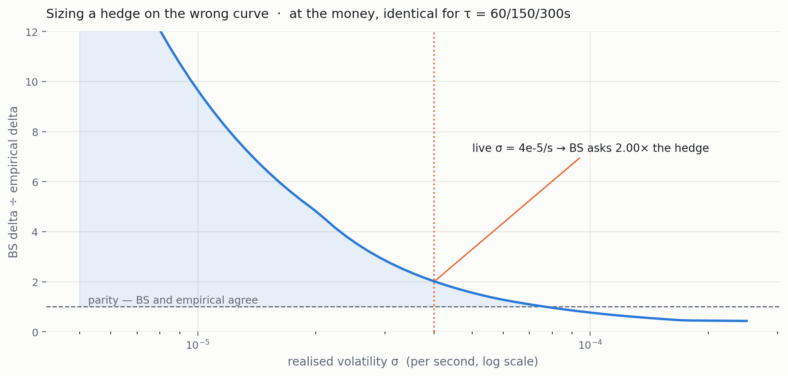

# Hedging — a read-only perp sidecar for binary-option inventory

When users buy YES on a 5-minute BTC binary, the house is short YES — and now
owns a directional bet on Bitcoin it never chose. This service watches that
inventory and holds an offsetting perpetual-futures position, so a move in BTC
doesn't move the book's expected settlement.

It **never writes to any exchange data store**. It reads inventory, computes an
aggregate delta, and trades only its own hedge account. Mainnet is hard-blocked at
construction; `dry-run` is the default venue.

```
 exchange inventory (Redis, read-only)
        │  qYes / qNo per market
        ▼
   aggregate settlement-value delta  ──►  vol + inventory gates  ──►  perp hedge
                                                                    (Binance demo)
```

---

## The thing to understand first

**A perpetual future cannot hedge a binary's terminal gamma.** This is a
mathematical fact, not a shortcoming of the implementation.

A perp is linear — Γ ≡ 0 by definition. A digital's value near expiry is a *step*,
its delta diverging as `φ(d)/(Sσ√τ)`. No linear instrument replicates a
discontinuity. Tested in an A/B, the worst-case window went **−$94.5 → −$94.5**:
a difference of exactly **0.0**, with hedging cost ≈ hedging benefit.

So this service does the job a perp *can* do — hedge **delta** — and does it well:
**33–37% of P&L dispersion removed**, worst-case window **−$115 → +$85/+$109**.
The residual is adverse selection, which no hedge can remove; only the spread pays
for that.

Terminal gamma is handled where it actually can be — in **quoting** (pin-risk
widening, expiry lockout). Cross-market gamma hedging was tested as an alternative
and came back **NO-GO**.

---

## The bug worth reading about

The service originally sized hedges with the Black-Scholes digital delta, while
the exchange had already moved to quoting off an empirically-calibrated curve.
Hedging a sensitivity the book doesn't have is just a fee generator.

The two curves disagree by a factor that depends entirely on realised volatility —
and the sign of the error flips:

<picture>
  <source media="(prefers-color-scheme: dark)" srcset="docs/images/overhedge-dark.png">
  
</picture>

Generated by running this repo's own `core/digital.ts` and `core/empirical.ts`
across a σ sweep — not a reimplementation, and not hardcoded numbers.

Three things fall out of it:

- **The over-hedge ratio is independent of τ.** Identical for τ = 60, 150 and 300s.
  Both curves' ATM slopes scale as `1/√τ`; only the constant differs.
- **It depends strongly on σ.** At the realised σ the live service reported
  (4e-5/s) BS demands **2.0×** the correct hedge. In calm markets it exceeds
  **11×**.
- **Past a crossover it inverts.** Above ~7e-5/s, BS *under*-hedges. So "BS
  over-hedges" isn't a fixed correction factor — it's a regime-dependent error,
  which is exactly why the fix was to differentiate the curve you actually quote
  on rather than apply a fudge factor.

Production measurement over live quotes found the same effect from the other
direction — 1.6–2.2× over-hedging, 3.15× at the money — consistent in sign and
magnitude with the low-σ regime here. `deltaCurve: 'empirical'` is now the
default; `'bs'` is retained only as a rollback path.

## Other things that were wrong, and are now tested

| Problem | Fix | Test |
|---|---|---|
| `KEYS` scan of the whole Redis keyspace each poll — O(N) and **blocking** on a shared production instance | read the active-markets set instead; `keys` is deliberately absent from the `RedisLike` interface | `inventory.test.ts` — 10k markets |
| Contract inventory reported under delta's name — showed a **$66.8M "skew"** on ~$1,000 of real flow | `netContracts` and `delta` split into separate fields with distinct units | `inventory.test.ts` |
| Delta diverging as τ→0 demanded ~60 BTC of hedge on a book that needed 3.5 | `minTauSec` floor + `expiryLockoutSec` — deliberately under-report rather than chase an unfillable hedge | `boundary.test.ts` |
| Malformed Redis values poisoning the aggregate into NaN, silently disabling *all* hedging | `safeNum()` guards; a bad key skips one market, never the book | `inventory.test.ts` |

**51 tests, all passing** — sign conventions, netting across markets, gates,
boundary behaviour at expiry, fee/taper logic and a 10k-market scale check.

```bash
npm test        # 51/51
npm run qa      # full QA sweep
```

---

## Running it

```bash
cp .env.example .env       # EXECUTION_VENUE=dry-run by default
npm install
npm start                  # control plane on :8790
```

```bash
curl localhost:8790/state
```

```jsonc
{
  "spot": 63544.01,
  "inventory": {
    "aggregateDelta": 0,          // BTC-equivalent settlement-value delta
    "netContractsYes": 0,         // signed lean, in CONTRACTS (not dollars)
    "deltaCurve": "empirical",
    "markets": [ { "marketId": "btc5m…", "strike": 63540, "delta": 0, "gamma": 0 } ]
  },
  "gate":    { "armed": false, "idleReason": "idle-inv", "volGateOn": true },
  "hedger":  { "enabled": true, "livePosition": 0, "hedgePnl": 0 },
  "venue":   "dry-run"
}
```

**Two gates decide whether to trade at all.** A hedge that fires on every wobble
pays fees for nothing, so the hedger arms only when realised vol breaches a
threshold *and* exposure clears an inventory floor. `idleReason` always says which
one is holding it back — above, the book is flat, so `idle-inv`.

Venues: `dry-run` (default, simulates fills, no keys needed) or `binance-demo`
(paper). Mainnet hosts throw at construction.

---

## Related

| Repo | What it is |
|---|---|
| [Prediction-Market-Platform](https://github.com/sidjainnn/Prediction-Market-Platform) | the exchange whose inventory this hedges |
| [AMM_Hedging](https://github.com/sidjainnn/AMM_Hedging) | the research simulator where the hedging results were derived |
| [Kronos-Price-Discovery](https://github.com/sidjainnn/Kronos-Price-Discovery) | can a learned model beat the pricing curve? |

TypeScript · Fastify · ioredis · no real money.
